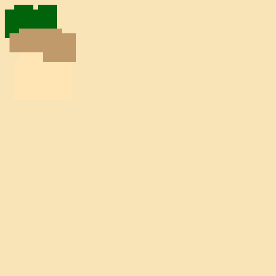
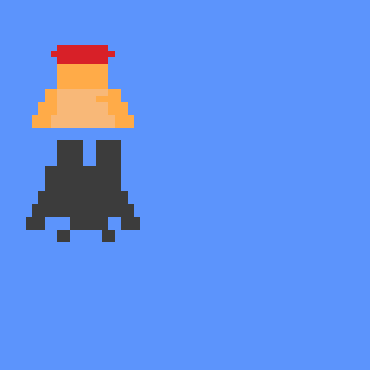

# ChatGPT pixel art

## Egypt

> Generate the JavaScript code needed to display pixel artwork on a 58*58 canvas. The theme of the artwork should be Egypt. Containing a pyramid, palm trees and camels.

## Mario

> Can you change the artwork to resemble mario?

